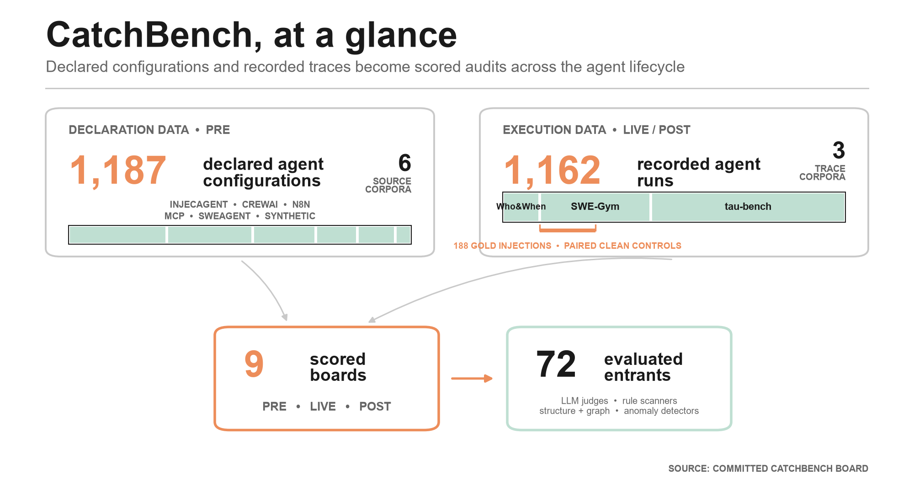
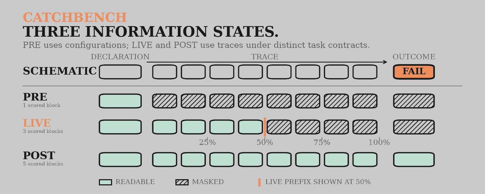
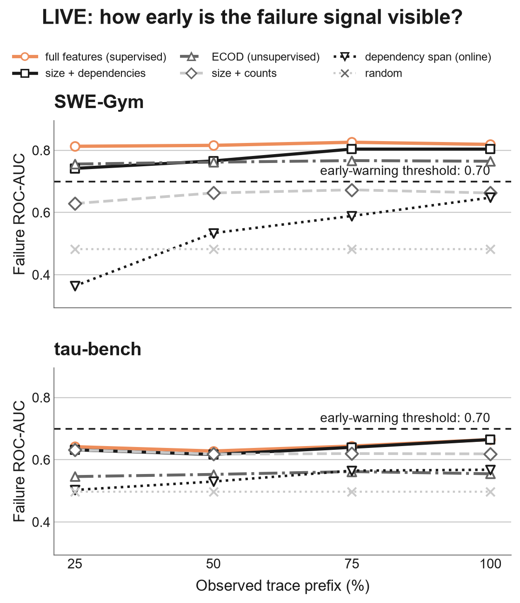
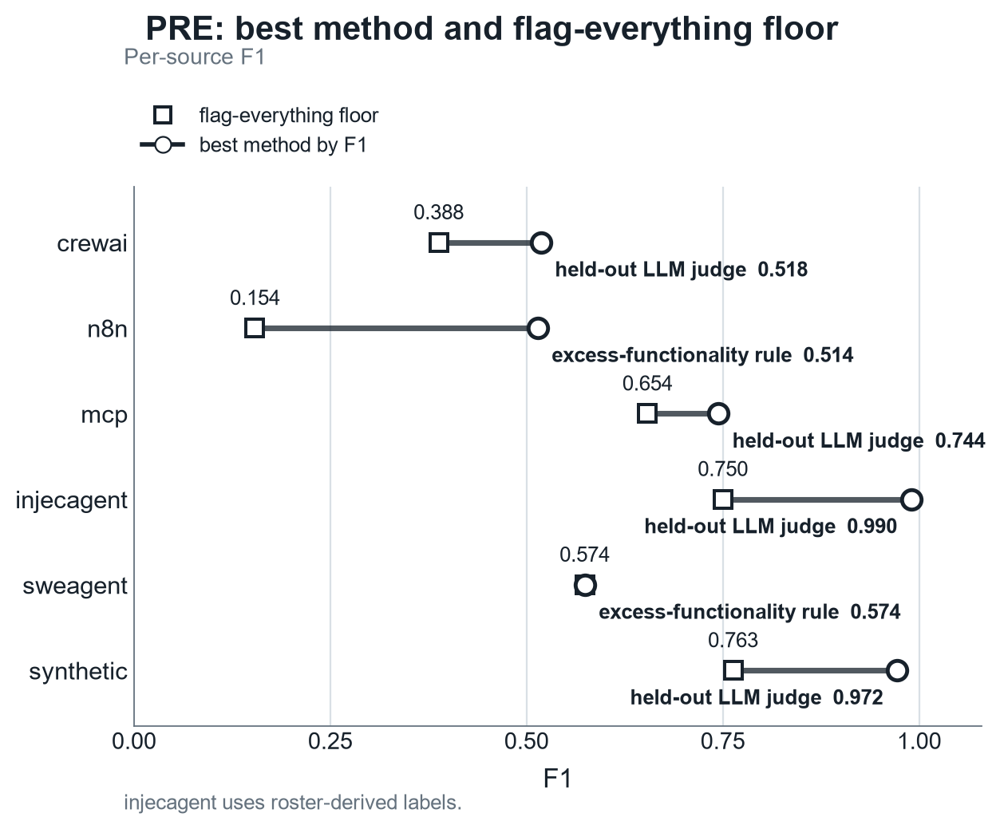

<div align="center">

# CatchBench

**When can an agent failure be caught?**

A benchmark for auditing agents across three information states: the declared configuration before a
run, a growing prefix while it runs, and the finished trace after it ends.

[](https://arxiv.org/abs/2608.22808)
[](LICENSE)
[](pyproject.toml)
[](tests/expected_tests.txt)
[](#the-boards)

[Quickstart](#quickstart) · [The Boards](#the-boards) · [Task List](#the-full-task-list) · [Add a Method](#how-a-method-plugs-in) · [Full Install](#the-full-board)

</div>

An audit is limited by the record more often than by the method. CatchBench holds the run fixed and
varies what the auditor may read: before it runs you have only the plan and harness (is it
over-privileged?); while it runs you have a growing prefix (is it about to fail?); after it runs you
have the whole trace (which step broke it, did it fail, what kind of fault was it). Six audit
scenarios produce seven task contracts (localization has two instantiations, human-labeled and
injected), scored as nine boards, all sharing one `Task` and `Method` interface.



What the boards show, in plain terms:

- On SWE-Gym, a run's dependency structure predicts failure better than its raw size and step counts.
  The same comparison on tau-bench is inconclusive, so the board reports it as unresolved rather than
  naming a winner.
- No tested method flags a failing tau-bench run before it finishes.
- On two of six configuration sources, no over-privilege method clearly beats the trivial baseline of
  flagging every capability.
- Eight of eleven LLM judges sit in a band these runs cannot tell apart, so the board declines to
  rank them.

## Quickstart

The PRE board scores offline from committed records. No model key, no corpus download, no GRADE
checkout, and no torch. It is a real board, not a toy: these are the same numbers the full run
prints.

```bash
python -m pip install "catchbench>=0.1.1"
catchbench --task pre        # about a second
```

These are installed-package commands. Release 0.1.1 is the first wheel that includes the PRE
records and the `catchbench` console command; the 0.1.0 wheel omitted both. `python run.py`,
`python tools/...`, and `pytest tests` are repository commands and require a clone. The complete
board also requires the GRADE checkout and optional dependencies described in
[The Full Board](#the-full-board).

You get eleven scored rows over 1187 declared agent configurations, and a per-source breakdown,
because a pooled F1 over four different label processes hides more than it shows. Three of the
eleven rows are references rather than methods: the `flag_all` and `flag_none` floors, and an
oracle that reads the answer.

> [!TIP]
> Read the `flag_all` row first. A method earns its false alarms only by clearing that floor. On two
> of the six sources none does: on `sweagent` flagging everything ties the best method, and on `mcp`
> the best method's lead over the floor does not resolve.

The POST, LIVE, and Gold boards need the GRADE bridge and about 320 MB of corpora, and take roughly
nine minutes. That path is under [The Full Board](#the-full-board).

### For Coding Agents

No repository clone, model key, GRADE checkout, torch installation, or corpus download is needed for
the PRE board above. The `pip install` step may contact PyPI; the `catchbench --task pre` command
itself then runs offline and normally finishes in about a second. A successful run's output contains
both of these exact lines:

```text
CatchBench :: PRE board (offline; no GRADE bridge, no corpus download)
PRE over_privilege: 1187 configs across 6 corpora {'crewai': 298, 'injecagent': 340, 'mcp': 144, 'n8n': 219, 'sweagent': 130, 'synthetic': 56}
```

An agent that needs the full board must clone CatchBench and GRADE as siblings, check GRADE out at
the pinned commit, install `../grade[experiments]`, install the pinned CPU torch build and matching
`pyg_lib` backend, and install CatchBench with its `full` extra. It also needs network access on
every run to verify the three Hugging Face dataset heads. Budget about nine minutes and a large
corpus download on the first run. Follow the exact commands and compatibility note in
[The Full Board](#the-full-board); run plain `catchbench` only after that setup.

<details>
<summary>How this compares to earlier agent-auditing benchmarks</summary>

Earlier agent-auditing benchmarks include
[R-Judge](https://arxiv.org/abs/2401.10019), which evaluates safety-risk awareness from agent
interaction records, and [Agent Security Bench](https://arxiv.org/abs/2410.02644), which evaluates
attacks and defenses for LLM-based agents. CatchBench differs in the lifecycle organization and
shared interface, in the spirit of ADBench for tabular anomaly detection and BOND for graph anomaly
detection.

</details>

## The Dataset Is the Asset

A benchmark is worth what its data is worth, because methods within a task run on the same data. The
value here is a collection of agent traces and harness configurations represented through
task-specific structures and paired with labels. The borrowed POST labels are human fault attribution
from Who&When and run-level outcomes from SWE-Gym and tau-bench. Gold and PRE use constructed labels
whose processes and
limitations are stated on their boards. New methods plug into a fixed `Task` and are scored through
the same interface. The library [`auditable`](https://github.com/yzhao062/auditable) provides one
method implementation; this repository provides the benchmark tasks and comparisons.

## Why PRE / LIVE / POST

The pillars are not three convenient buckets; they are the three information states a run passes
through, and the evidence available at each fixes which audit is possible. A method built for one
state cannot read another's evidence, so the pillars are separate tracks, not interchangeable views of
one dataset.



The scored block identities are the ones `run.py` prints and `tests/golden/board.txt` records. A
reader can go from an audit question to its scored block without a lookup table.

- **PRE** (only the plan and harness exist): the audit is static, for over-privilege and missing
  guardrails. **Over-privilege implemented; missing-guardrail planned.**
- **LIVE** (a growing prefix is visible, the outcome is not): the audit is predictive and runs under a
  false-alarm budget, for early warning from a streaming prefix and online detection. **Implemented.**
- **POST** (the complete trace and outcome are in hand): the audit is forensic, answering which step
  failed, whether it failed, and what kind of fault it was. **Implemented.**

Within a pillar, each board is the specific question an auditor asks at that state, paired with the
label that answers it and the metric the question implies (ranking questions use Top-k / MRR; a
yes-or-no question uses ROC-AUC; an online question uses true-positive rate at a fixed false-positive
budget so that its alarm burden is visible).

<details>
<summary>Seven implemented task contracts, plus one planned</summary>

#### The Full Task List

Each task is one auditor question at one information state, with the label that answers it, not a
list chosen for coverage. Implemented in the current build:

- **Fault localization** (POST, *which step*): rank the steps of a failed run. Top-1 / Top-3 / MRR
  against Who&When human attribution.
- **Failure detection** (POST, *did it fail*): predict run failure. ROC-AUC against SWE-Gym and
  tau-bench resolved / unresolved outcomes.
- **Cause attribution** (POST, *what kind*): tell stale-state from dropped-grounding on a paired Gold
  injection (the same run injected both ways). ROC-AUC.
- **Gold fault localization** (POST, injection experiment): plant a known fault in a real run and
  localize it. Top-1 / Top-3 / MRR against injection-site labels.
- **Streaming early warning** (LIVE, *can you tell early*): flag a failing run from a growing prefix.
  Prefix-AUC and time to detection.
- **Online stale-state detection** (LIVE, *catch it live*): detect the Gold stale-state injection
  online. True-positive rate at a fixed false-positive budget.
- **Over-privilege audit** (PRE, *is the declared harness safe*): flag granted capabilities the task
  does not need. Compare an OWASP / CWE static-scanner set and a held-out LLM judge against the four
  constructed label processes. Precision / recall / F1 over 1187 configs from six corpora.

Planned:

- **Missing-guardrail plan audit** (PRE, *is the plan safe*): flag removed or weakened guardrails in a
  declared plan.

</details>

## The Boards

POST answers its three forensic questions (which step, did it fail, what kind) plus the Gold injection
board, whose injection-site labels inherit the file-level construction artifact documented below. LIVE
answers its two real-time questions (early warning from a prefix, online detection). PRE answers the
deploy-gate question (is the declared harness over-privileged) using the four constructed label
processes documented on that board. Run `catchbench` to recompute the boards from the available
inputs; exact agreement with the displayed values has the revision and environment qualifications in
the Paper section. The POST localization, detection, and Gold boards and the PRE over-privilege board
have headline tables below; the cause-attribution board and the two LIVE boards are summarized at the
end. `run.py` prints the additional method and metric rows.

<details>
<summary>Fault localization on Who&When: headline table, interpretation, and limits</summary>

### Fault Localization on Who&When

Rank the steps of a failed run by how likely each is the fault, scored against the human
`mistake_step`. 126 failed runs, 1099 steps, 11% of steps are faults.

| Method | Top-1 | Top-3 | MRR |
|---|---|---|---|
| **LLM-judge panel (all-at-once)** | | | |
| GPT-5.5 | 0.452 | 0.667 | 0.618 |
| Claude-Opus-4.8 | 0.421 | 0.698 | 0.605 |
| GPT-5.4 | 0.413 | 0.714 | 0.601 |
| DeepSeek-R1 | 0.405 | 0.754 | 0.606 |
| Gemini | 0.357 | 0.722 | 0.572 |
| Qwen3-32B | 0.349 | 0.659 | 0.541 |
| GPT-oss-20B | 0.333 | 0.595 | 0.521 |
| Llama-3.3-70B | 0.333 | 0.579 | 0.515 |
| Gemma-3-12B | 0.206 | 0.524 | 0.427 |
| Mistral-Small | 0.135 | 0.421 | 0.363 |
| Nova-Micro | 0.127 | 0.397 | 0.342 |
| **Structural / baseline (no LLM)** | | | |
| exec-rank (sup.) | 0.211 | 0.614 | 0.454 |
| `auditable` (blast share) | 0.159 | 0.516 | 0.407 |
| position prior | 0.159 | 0.516 | 0.407 |
| PyGOD (graph AD, DOMINANT) | 0.048 | 0.302 | 0.258 |
| random | 0.119 | 0.346 | 0.324 |

How to read it. The direct LLM control shows a failed trace to a model and asks it to name the
decisive step. The 11-model panel uses one all-at-once prompt per run, following Who&When's protocol;
predictions are cached and committed, so scoring the board makes no API call. GPT-5.5 has the highest
Top-1 score here at 0.452. The panel spans 0.127 to 0.452, but eight of the eleven models sit in one
band from 0.333 up that 126 runs do not separate, so read the band rather than the ordering inside it.
Mistral-Small and Nova-Micro fall below the position prior on point estimate, but the registered
tests leave both unresolved against it.
Among methods that use no LLM, the supervised execution-feature ranker localizes beyond the prior on
Top-3 without an API call; its Top-1 margin over position does not resolve at this corpus size.
`auditable`'s blast share ties the prior at displayed precision because this
corpus assumes every step depends on all prior steps. PyGOD DOMINANT has the only displayed Top-1
point estimate below chance, 0.048 against the 0.119 random floor; no registered contrast tests that
pair. The benchmark uses
separate structural methods in LIVE settings, where a full-trace judge cannot run. Separating a
dependency signal from raw position requires traces in which long-range dependencies diverge from
the corpus's full-context assumption.

</details>

<details>
<summary>Failure detection on SWE-Gym and tau-bench: headline tables, wider arena, stability, and lineage</summary>

### Failure Detection on SWE-Gym and tau-bench

Predict whether a run failed, scored by ROC-AUC. The comparison asks whether the dependency
structure of a run predicts failure beyond its raw size and event counts. Compare `auditable (size+deps)` against
`size (flat)`.

SWE-Gym, 376 runs (188 failed, 188 resolved):

| Method | ROC-AUC |
|---|---|
| random | 0.483 |
| size (flat) | 0.663 |
| PyOD-flatten (ECOD) | 0.765 |
| PyGOD-DOMINANT (graph AD) | 0.547 |
| GUARDIAN (recon-AE) | 0.767 |
| `auditable` (size+deps) | 0.804 |
| full (reference) | 0.819 |
| G-Safeguard (supervised GNN) | 0.828 |

tau-bench, 660 runs (363 failed, 297 resolved):

| Method | ROC-AUC |
|---|---|
| random | 0.498 |
| size (flat) | 0.619 |
| PyOD-flatten (ECOD) | 0.555 |
| PyGOD-DOMINANT (graph AD) | 0.550 |
| GUARDIAN (recon-AE) | 0.542 |
| `auditable` (size+deps) | 0.665 |
| full (reference) | 0.665 |
| G-Safeguard (supervised GNN) | 0.626 |

How to read it. The size-normalized dependency block scores above the size-and-counts baseline on both
corpora (+0.141 on SWE-Gym, +0.046 on tau-bench), but only one of those is an established ordering.
On SWE-Gym the paired test separates the two (Holm p=0.0001), so the structural signal predicts
failure beyond run size and counts there. On tau-bench the same test does not resolve the pair (Holm
p=0.068), so read that +0.046 as a point estimate and not as a result. On tau-bench the
structural block and full-feature reference tie at the displayed precision (0.665), so the full vector
shows no displayed gain there. On SWE-Gym, PyOD ECOD exceeds the linear size model (0.765 over 0.663),
and the dependency-structure method scores higher again at 0.804.

CatchBench runs a wider unsupervised arena behind the headline table: the PyOD tabular family
(Isolation Forest, KNN, LOF, COPOD, HBOS) and the PyGOD graph family (DOMINANT, CONAD, AnomalyDAE,
GAAN). On SWE-Gym the tabular detectors span ROC-AUC 0.319 to 0.625, all below the 0.663 size
baseline. The graph family spans 0.547 to 0.850, and two of its members clear that baseline: CONAD at
0.750 and GAAN at 0.850. On tau-bench both families stay below the 0.619 size baseline, 0.504 to
0.593 for the tabular set and 0.490 to 0.552 for the graph set. GUARDIAN, the agent-specific
reconstruction autoencoder, scores 0.767 next to ECOD at 0.765.

Read that SWE-Gym graph maximum carefully. GAAN's 0.850 is a single-seed number, and its five-seed
range overlaps the supervised references. Ranking only within runs of exactly equal node count leaves
it no advantage beyond run size on the matchable subset (`tools/pygod_seed_stability.py`). The same
family fares worse on the other boards. DOMINANT lands under the random floor on Who&When
localization, and every PyGOD entry stays below the size baseline on tau-bench. No off-the-shelf
detector establishes a task-relevant board lead. Neither does the task-aware structural method
against the better ones: on SWE-Gym its paired tests against ECOD and against GUARDIAN both fail to
separate (Holm p=0.404 and p=0.376), and failing to separate is not evidence that they are equal.
G-Safeguard is
the supervised graph comparator, with the highest supervised SWE-Gym point estimate at 0.828 and
0.824 +/- 0.007 over five cross-validation seeds.

#### Baselines and Lineage

The graph-AD baselines are ports of published methods onto the dependency graph, in the ADBench /
BOND tradition of running a method on the benchmark's representation rather than gesturing at it.
PyGOD's DOMINANT (Ding et al., 2019, *Deep Anomaly Detection on Attributed Networks*, SDM) is an
unsupervised graph autoencoder that scores nodes by reconstruction error. GUARDIAN (Zhou et al.,
2025, arXiv:2505.19234), which safeguards multi-agent collaborations with a reconstruction-error
temporal graph autoencoder, is implemented here as a directed-GCN attribute-reconstruction
autoencoder over the per-run graph; the explicit adjacency-reconstruction term and the
information-bottleneck compression are simplified, as the code documents. G-Safeguard (Wang et al.,
2025, arXiv:2502.11127) uses a GNN to detect anomalies on a multi-agent utterance graph; here it is
implemented as a supervised graph-classification GNN over the dependency graph. Its 0.828 is the
highest displayed value on the SWE-Gym table, though the paired test against the full-feature
reference does not resolve the two (Holm p=1).

</details>

<details>
<summary>Gold injected-fault boards: full-pool and eligible-pool results, and where the injection does and does not yet hold up</summary>

### Gold: Injected Faults on Real Runs

The boards above borrow labels (human attribution, run outcomes). Gold plants a fault in a fetched
clean run and asks whether a method points to it. There are 188 clean SWE-Gym runs with one injected
fault each: 82 stale-state and 106 dropped-grounding. A run affords a stale-state fault only when it
has an earlier superseded same-file event to redirect to. The label records the injection site by
construction; it does not establish that the alteration is a realistic fault, and the file-level
substrate has the construction artifact documented below. The numbers below are one representative
seed, with
mean and standard deviation across five injection seeds printed by `run.py`. Read the board per fault
kind because the two injected mechanisms behave differently and the aggregate hides that difference.

| Method | overall Top-1 | stale-state Top-1 | dropped-grounding Top-1 |
|---|---|---|---|
| random (seed-averaged) | 0.032 | -- | -- |
| position (leak check) | 0.000 | 0.000 | 0.000 |
| degree (leak check) | 0.045 | 0.073 | 0.023 |
| has-dep (control) | 0.078 | 0.173 | 0.005 |
| max-span (control) | 0.309 | 0.703 | 0.005 |
| `auditable` (dep-anomaly) | 0.309 | 0.703 | 0.005 |
| PyGOD (graph AD) | 0.165 | 0.256 | 0.094 |

The injector can target only steps that meet the precondition for the selected fault kind, so the
full-pool table mixes fault localization with target eligibility. The eligible-pool control re-ranks
each method only within the steps the injector could have picked for that run's fault kind, with a
mean of 7.4 candidates per run. It matches eligibility, not exact degree. The random floor rises
accordingly, and ties are averaged so a constant-score baseline lands on the floor instead of winning
on sort order.

| Method (eligible pool) | overall Top-1 | stale-state Top-1 | dropped-grounding Top-1 |
|---|---|---|---|
| random (matched floor) | 0.308 | 0.350 | 0.277 |
| position | 0.330 | 0.341 | 0.321 |
| degree | 0.225 | 0.394 | 0.095 |
| has-dep | 0.195 | 0.350 | 0.075 |
| max-span | 0.394 | 0.805 | 0.075 |
| `auditable` (dep-anomaly) | 0.391 | 0.799 | 0.075 |
| PyGOD (graph AD) | 0.404 | 0.622 | 0.236 |

How to read it. The registered full-pool family establishes max-span above the stale-state analytic
floor, 0.703 against 0.029, and `has-dep` below the dropped-grounding analytic floor, 0.005 against
0.035. It declares no other method-versus-floor contrast in either pool, so all remaining comparisons
to a floor in these tables are displayed cells. Within the eligible pool, `has-dep` displays 0.350 on
stale-state, degree displays 0.394, and max-span displays 0.805 against the displayed 0.350 floor.
For dropped grounding, position displays 0.321 against 0.277. PyGOD displays 0.622 on stale-state,
0.236 on dropped grounding, and 0.404 overall; its registered overall comparison with max-span remains
unresolved. These point estimates diagnose mechanisms but establish no additional floor ordering.

#### The Injection: Where It Holds Up, and Where It Does Not Yet

The injection checks include both the measured signal and its known limitations:

- **One established localization mechanism.** Stale-state max-span separates from its analytic floor,
  at 0.703 against 0.029 for this seed and 0.653 +/- 0.028 across five injection seeds. For dropped
  grounding, the registered family establishes only `has-dep` below its analytic floor; it declares no
  floor contrast for span, degree, or the graph detector, so it does not establish dropped-grounding
  localization.
- **Leakage check, two levels.** In the full pool, position, degree, and `has-dep` display 0.000, 0.045,
  and 0.078 overall against the 0.032 random floor. The latter two point estimates are above the floor,
  but the Gold localization family declares no overall floor contrast for either. Ranking within the
  exact eligible pool controls target selection.
  On stale-state, `has-dep` equals the matched floor at 0.350, degree scores 0.394,
  and the dependency-span detector scores 0.805, with 0.795 +/- 0.020 across seeds. That controls
  selection, not construction: the
  clean substrate wires every file event to its immediate same-file predecessor, both injections break
  exactly that invariant at the injected step, and a broken-predecessor baseline
  (`tools/gold_artifact_diagnostic.py`) uniquely ranks all 82 stale-state and all 106
  dropped-grounding targets Top-1 while flagging 0 of 188 clean runs, across five injection seeds.
  Both fault kinds therefore fail the no-artifact-leakage bar on the file-level substrate; read the
  Gold boards as mechanism diagnostics. Artifact-controlled evidence is not yet available.
- **Distribution shifts.** Stale-state preserves the valid dependency-edge
  count (mean 9.2, unchanged); dropped-grounding removes exactly one valid dependency edge (mean 7.9 to
  6.9), so treat edge count as a reported run-level shift for the dropped half, not as matched.
  Stale-state also lengthens the run-level max dependency span by construction. The board's span line
  is not split by fault kind: across all 188 paired runs the mean rises from 8.6 to 9.4 and 53
  increase, and only 82 of those runs carry a stale-state injection. Localization still requires
  finding the step.
- **Constructed labels.** The label records the step modified by the injector and is independent of
  detector output. It identifies the programmed modification, not a human-verified natural fault.
- **Characterized caveat.** SWE-Gym dependencies are inferred, not gold value-flow, so a redirected
  edge is a dependency-misattribution proxy for a true stale read. An artifact-controlled test
  requires a named-value corpus where writes and reads are explicit, plus a human-audited validation
  slice.

</details>

<details>
<summary>Cause attribution and LIVE boards: paired mechanisms, early warning, and online detection</summary>

### Cause Attribution and the LIVE Boards

Three more boards complete the POST and LIVE pillars; `run.py` prints their full tables.

**Cause attribution (POST, what kind).** Given a faulty run, is it stale-state or dropped-grounding?
The substrate is paired, with the same run injected both ways, so run identity and eligibility are
held fixed. The label records which injection was applied; it does not show that these two categories
cover naturally occurring causes. On 166 paired runs the two injections leave opposite traces: a
stale read lengthens the max dependency span (ROC-AUC 0.675, and
0.671 +/- 0.005 across seeds), dropped grounding removes an edge (edge-count 0.566), against a 0.498
floor. Each feature is keyed to one mechanism, so this measures discrimination within the injection
design, not general cause attribution.

**LIVE streaming early warning (can you tell early).** Can a method separate failing from resolved
runs from a growing prefix? On SWE-Gym the registered 25% contrast separates the
dependency-structure block from the flat size-and-counts baseline. Their point estimates are 0.74 and
0.63. The 20-cell SWE-Gym bar family is exploratory: it was added after these scores were examined
and needs fresh data to confirm. It is two-sided and resolves nine cells. It places full
above 0.70 at every prefix and auditable above it at 75% and 100%, and it places the online span
scalar below the bar at 25%, 50%, and 75%. Auditable at the two early prefixes, all four ECOD cells,
and the rest are unresolved. Random is an untested
reference. The raw per-run span point estimate is 0.36 at 25% and is length-confounded. On tau-bench,
none of the reported methods reaches the 0.70 time-to-detection threshold. Its registered bar family
resolves all five nonrandom entrants below 0.70 through the first three prefixes; at 100%, full
features and size plus dependencies are unresolved against the bar, while the other three remain
below it.



Marker fill states the evidence against the dashed line: method color means the registered contrast
separates, mint means it is registered but unresolved, and hollow means the threshold reading is a
point estimate with no registered bar test. Each corpus registers all 20 nonrandom method-prefix
cells against the bar, two-sided. SWE-Gym resolves nine: full at every prefix and auditable at 75%
and 100% above the bar, and the online span scalar below it at the first three prefixes. Tau-bench
resolves 18, every one of them below the bar.
Random retains its x reference marker and is untested on both corpora. The panels therefore show a
descriptive domain split, not a registered cross-domain contrast. The online per-run span is the
lowest curve at the shortest prefix on SWE-Gym, and on tau-bench it sits just above the random
reference there; it is the only setting that is genuinely
online. Drawn by `figure-src/board_live_prefix.py` from `tests/golden/board.txt` and
`tools/statistical_tests_results.json`.

**LIVE online stale-state detection (catch it live).** The same Gold stale-state injection is detected
online at a fixed false-positive rate instead of localized post-hoc. At realized false-positive rates
of 6.1% and 11.0%, the prefix-only span z-score displays true-positive rates of 0.061 and 0.110; raw
span displays 0.122 and 0.159. Across five injection seeds, the corresponding means are 0.054 and
0.124 for the z-score and 0.098 and 0.151 for raw span. At the displayed 5% target, the dependency-
count control and z-score each display 0.061, while raw span displays 0.122. No contrast is declared
among these methods, so the cells are point estimates only. They support no claim about the effect of
per-run normalization. These are displayed cells from 82 paired runs. The same clean runs calibrate
and report each empirical threshold, and the five injection seeds reuse those runs rather than
supplying 410 independent observations. No method ordering is registered. The Gold 0.703 value
scores post-hoc within-run localization, a different decision, so it is context rather than a
cross-state effect estimate.

</details>

<details>
<summary>PRE over-privilege board: declared-configuration audit, label construction, standards mapping, results, and the injecagent shortcut</summary>

### Over-Privilege Audit on Declared Harnesses (PRE)

Before a run, the available evidence comes from the declared task or role and the capabilities its
harness grants. The PRE board asks whether a method can flag granted capabilities that the task does
not need. It runs over 1187 configurations from six corpora (crewai, n8n, mcp, injecagent, sweagent,
and a synthetic set), each declared capability labeled needed or excess, scored by precision, recall,
and F1 over the flagged-excess set. The distributed PRE records contain declared-capability metadata,
labels, and a `spec_tokens` list derived from the task or role, not the upstream prose itself.

All PRE labels are constructed. The crewai, n8n, and mcp labels are the intersection of two LLM
judges' excess decisions, with overall Cohen's kappa 0.666; they remain subjective judgments with
imperfect agreement. The injecagent roster relabel treats its designated user tool as needed and its
attacker-tool roster as excess, so it evaluates those source roles rather than an independent need
annotation. The sweagent declared-minus-used heuristic treats every capability not exercised in the
observed trajectory as excess, although non-use does not prove lack of need. The synthetic labels are
authored injections, so they measure planted cases rather than a natural deployment distribution.

The static baseline maps each rule to an over-privilege category from OWASP LLM06:2025 Excessive
Agency, the OWASP Agentic Security Initiative (ASI), and the CWE privilege family:

| Standard category | Scanner rule | Reference |
|---|---|---|
| Excessive permissions / least privilege | `owasp_excess_permissions` | OWASP LLM06; CWE-272, CWE-250 |
| Excessive functionality | `owasp_excess_functionality` | OWASP LLM06 |
| Privilege compromise / escalation | `owasp_privilege_escalation` | CWE-269; OWASP ASI (Privilege Compromise) |
| Excessive autonomy (approximation) | `unrequested_high_impact` | OWASP LLM06 (autonomy driver) |
| Sensitive-access exposure surface | `sensitive_access` | OWASP LLM02 (risk surface) |

`owasp_asi_combined` is their union. Three standard concerns are named but stay out of static
single-config scope, and the board says so rather than overclaiming: a full excessive-autonomy check
needs an approval-gate field the schema does not carry, so `unrequested_high_impact` is an
approximation (a high-impact action the task never asks for); full ASI Tool Misuse needs declared
operation, scope, and allowlist controls the schema does not express, so `sensitive_access` is a
narrower LLM02 exposure heuristic; and a deprecated or duplicate extension needs deployment history.
The board scores each rule and the union, so coverage is visible rather than asserted:

| Method | Precision | Recall | F1 | Coverage |
|---|---|---|---|---|
| flag-all (floor) | 0.430 | 1.000 | 0.601 | 1.000 |
| flag-none (floor) | 0.000 | 0.000 | 0.000 | 1.000 |
| risky-permission scan | 0.418 | 0.564 | 0.480 | 1.000 |
| `owasp_excess_permissions` | 0.504 | 0.506 | 0.505 | 1.000 |
| `owasp_excess_functionality` | 0.538 | 0.796 | 0.642 | 1.000 |
| `owasp_privilege_escalation` | 0.811 | 0.010 | 0.020 | 1.000 |
| `unrequested_high_impact` | 0.633 | 0.148 | 0.240 | 1.000 |
| `sensitive_access` | 0.763 | 0.016 | 0.030 | 1.000 |
| `owasp_asi_combined` | 0.511 | 0.910 | **0.654** | 1.000 |
| LLM judge, held out (Llama-3.3-70B) | 0.594 | 0.839 | **0.695** | 0.996 |
| oracle (declared minus minimal) | 1.000 | 1.000 | 1.000 | 1.000 |

Coverage is the share of the 1187 configurations a method actually judged. Every rule answers all of
them; the held-out judge abstains on 5, so its precision, recall, and F1 are computed over 1182. Rows
on different denominators are not comparable cell for cell. The per-source section below says why the
judge abstains and where.

How to read it. The combined OWASP/CWE scanner has the highest displayed rule-based F1 (0.654, 0.910
recall), against 0.695 F1 for the held-out LLM judge on the 1182 configs it answered. Its predictions
include unnecessary read and unknown capabilities through the excessive-functionality rule, not just
risky permission levels.
The three rules make 37 privilege-escalation, 59 sensitive-access, and 676 unrequested-high-impact
predictions over the full 1187-config board. Their low overall recall shows that each identifies a
limited slice of the aggregate excess set. The corpus labels one undifferentiated excess
set with no per-category annotation, so it cannot say how prevalent each standard category is, and
these rules' precision is measured over those small-to-moderate samples rather than a category-level
ground truth. Three rules display a higher precision cell than the judge's 0.594:
`owasp_privilege_escalation` at 0.811, `sensitive_access` at 0.763, and `unrequested_high_impact` at
0.633. No registered contrast compares any rule's precision with the judge's, and the judge abstains
so it is scored on a different set of configurations, which is the same reason the coverage column
exists. Read those three as printed cells, never as a ranking against the judge.
The crewai, n8n,
and mcp labels were made by two other judges (GPT-5.5 and Claude), so the Llama-3.3-70B baseline did not
create its own evaluation labels. The scanners are keyword-based and language-limited: a task spec in
a language outside the keyword lists falls back to the read-only floor and over-flags.

Read the board per source, because the four label processes differ and a pooled F1 hides it (the
per-rule per-source numbers print from `run.py`):

| Method | crewai | n8n | mcp | injecagent | sweagent | synthetic |
|---|---|---|---|---|---|---|
| risky-permission scan | 0.326 | 0.095 | 0.575 | 0.827 | 0.025 | 0.803 |
| `owasp_asi_combined` | 0.448 | 0.411 | 0.644 | 0.961 | 0.570 | 0.842 |
| LLM judge, held out | 0.518 | 0.362 | 0.744 | 0.990 | 0.467 | 0.972 |
| oracle | 1.000 | 1.000 | 1.000 | 1.000 | 1.000 | 1.000 |



Each row compares one source's best method against that same source's floor, which is the only
comparison the labels support. The floor itself moves by nearly a factor of five across the six
sources, so a pooled F1 says little about whether a method earned its false alarms anywhere. The two rows drawn
in grey are the ones where the registered paired test declines to separate the best method from the
floor, and they are drawn without an ordering on purpose. Drawn by `figure-src/board_pre_source.py`
from `tests/golden/board.txt` and `tools/statistical_tests_results.json`.

Label origin per column: crewai, n8n, and mcp carry cross-vendor LLM-judge labels (Cohen's kappa 0.666,
`data/pre/LABEL_QUALITY.md`); injecagent is a roster relabel; sweagent is declared-minus-used; the
synthetic set is injection. The held-out judge lands near the top on injecagent (0.990) and synthetic
(0.972), where the labels are constructed, and lands between 0.36 and 0.74 on the judge-labeled
corpora.

The injecagent column carries a shortcut, and it is worth stating plainly rather than leaving for a
reader to find. The harvester wrote each configuration's legitimate tool first and the attacker tools
after it, and the released records preserve that order. So on all 340 injecagent configurations the
first declared capability is exactly the minimum and the rest are exactly the excess. A rule that
reads nothing but list position, keeping the first capability and flagging the tail, scores 1.000 F1
there: 510 true positives, no false positives, no false negatives. That is above the 0.990 held-out
judge and above every other method in the table. The same rule scores 0.446 on crewai and 0.106 on
n8n, which is how we know the shortcut lives in that corpus rather than in the rule.
`tools/statistical_tests_results.json` records it under
`reported_quantities.pre.declaration_order_leak`. Read the injecagent column as a property of its
construction, not as a difficulty ranking.

Using a different scoring judge avoids direct label reuse: either label-making judge would
inherit perfect recall on the intersection labels and an inflated F1 by construction. This separation
does not turn the constructed labels into human ground truth. In n8n, where the mean excess ratio is
0.084, the non-oracle methods in the table score from 0.095 to 0.411 F1.

The held-out judge answered all 1187 configs. Five of its replies named a capability whose spelling
did not match the declared roster. The parser that built the committed cache is all-or-nothing, so
one unmatched name throws out the whole judgment, and those five never reached the cache. The judge
abstains on them. They leave the denominator rather than counting as silent negatives. A reply nobody
could read is a fact about the parser, and scoring it as an empty prediction would charge the method
for it. The judge's scores therefore cover 1182 of 1187 configs, the coverage 0.996 on the board
above. The abstentions land in two columns: n8n is scored on 215 of 219 and mcp on 143 of 144. One of
them is large, a 622-capability MCP server carrying 337 of the corpus's 2893 excess labels. A
head-to-head claim between the judge and a rule therefore needs a common evaluable set.

</details>

## How a Method Plugs In

One scenario is one `Task`; a `Method` scores a `Task`; `RunPipeline` runs every valid
`(Task, Method)` pair and prints the leaderboard. A new entry is one small class:

```python
class MyDetector:
    method_id = "my-detector"
    supports = {"post_detection"}          # the task_ids it runs on

    def evaluate(self, task):
        task.setup()                        # loads the corpus once
        scores = my_model(task.layers["flat"])
        return {"roc_auc": roc_auc(task.y, scores)}
```

The same `Task` feeds every method, so the comparison is apples to apples and the dataset, not
the method, is the fixed point. See `src/catchbench/core.py` for the contract and
`detection.py` / `post.py` for the implemented baselines.

## The Full Board

<details>
<summary>Install and reproduce all POST, LIVE, Gold, and PRE boards (about nine minutes, one-time corpus download)</summary>

Every board, including POST, LIVE, and Gold. Budget about nine minutes and 320 MB on the first run.
Later runs reuse the revision-keyed cache, but every run still re-resolves the three dataset heads
against the Hub and refuses to score if any has moved, so the full board needs network each time.

```bash
git clone https://github.com/yzhao062/catchbench.git
git clone https://github.com/yzhao062/grade.git
git -C grade checkout 3839a57ac165d58a807fce0a3ff38346732ee936   # the pinned commit CI uses
cd catchbench
python -m pip install -e "../grade[experiments]"

# Pinned torch first, then its matching compiled backend. See the note below for why the order
# matters; installing ".[full]" on its own resolves an unpinned torch that pyg-lib has no wheel for.
python -m pip install "torch==2.12.1" --index-url https://download.pytorch.org/whl/cpu
python -m pip install pyg_lib -f https://data.pyg.org/whl/torch-2.12.1+cpu.html

python -m pip install -e ".[full]"
catchbench
```

The runner reuses GRADE's verified Who&When and SWE-Gym / tau-bench loaders and evaluations for
the reference methods, and computes the `auditable` baseline through `auditable`'s own public
kernel (`SessionGraph` plus `downstream_reach`). SWE-Gym and tau-bench download from the Hugging
Face Hub on first run. GRADE is not on PyPI, and its experiment modules are not included in its
wheel, so keep its checkout next to this repository as shown above. Alternatively, set `GRADE_DIR`
to its checkout.

> [!IMPORTANT]
> Why the two pinned lines come before `.[full]`. The `full` extra declares `torch` without a
> version, so on its own pip resolves whatever torch is newest. PyGOD's `NeighborSampler` needs a
> compiled backend matched to your exact PyTorch build, and PyG publishes that index later than
> PyTorch publishes the build, so the newest torch is usually the one pyg-lib has no wheel for.
> Installing the pinned pair first satisfies the `full` extra's unpinned requirement, and pip then
> leaves the working build in place. Both workflows install in this order, and
> `tests/test_workflow_pins.py` holds the two pinned versions equal to each other.
>
> Get the order wrong and the PyGOD rows raise on import rather than scoring. Every other board is
> unaffected, and the heavy dependencies load only when their baselines run. To recover without
> reinstalling everything, rerun the two pinned lines above.

<details>
<summary>What each verification command checks</summary>

| Command | What it proves | Needs |
|---|---|---|
| `catchbench --task pre` | The PRE board reproduces, offline | nothing |
| `python tools/ci_smoke.py` | Imports resolve; PRE floors hold | nothing |
| `pytest tests --ignore=tests/canary -q -ra` | Every contract test, with every skip named | GRADE checkout, the graph-AD stack, and `CATCHBENCH_PAPER_DIR` |
| `catchbench` | Every board reproduces | GRADE + corpora + network |
| `python tools/check_board.py` | The board still matches the committed golden | GRADE + corpora |
| `python tools/check_board.py --readme-only` | Every table number is a board cell, and every prose numeral is board-backed or allowed with a reason | nothing |
| `python tools/print_corpus_revisions.py` | The three corpus commits are the pinned ones | network |

The `--readme-only` check is why the tables above can be trusted: every numeric cell in a README
table is compared against the committed board output, with no tolerance. A hand-typed table value
fails it. Prose numerals are checked too, under a looser rule: each must either equal a golden board cell
at the precision the prose printed, or be claimed by a named `PROSE_NUMBER_ALLOWLIST` entry that
carries its reason. Emphasis is outside its scope: the comparison strips markup, so bolding a
cell cannot be checked by it.

Run the suite with `-ra` rather than plain `-q`. Five contract tests are marked `needs-paper` in
[`tests/expected_tests.txt`](tests/expected_tests.txt) and skip unless `CATCHBENCH_PAPER_DIR` points
at a checkout of the manuscript repository. Three of them hold the manuscript's tables equal to
these boards. The other two hold its figures equal: one compares the board copy the manuscript's
figure scripts read against `tests/golden/board.txt`, and one runs both figure pipelines' board
parsers over the same board and compares the numbers they extract, because each repository carries
its own copy of that parser and a figure is the one place in a paper where no checker reads the
value.

**No workflow sets that variable**, because the manuscript repository is not public, so CI does not
currently fail when the paper falls behind the board. That comparison is run locally before a
submission. Plain `-q` reports the five as a bare skip count and never names them, which is the one
way this suite can look complete while the paper-side checks are not running.

The full board comparison is not exact everywhere. Three row prefixes (`guardian (`, `g-safeguard (`,
`pygod`) reconcile within 0.005, because the golden was generated on Windows and ubuntu CI reproduces
two of their values one digit apart from the float kernels underneath torch. Every other row stays
byte-exact, and `tests/test_board_tolerance.py` fails if the tolerance widens past the seed variance
the paper publishes.

</details>

</details>

## Reference, Origins, and Release

### Paper

*[CatchBench: When Can an Agent Failure Be Caught?](https://arxiv.org/abs/2608.22808)* is posted as
arXiv:2608.22808. It carries its own work-in-progress notice: the benchmark is still being extended,
and the numbers below are the ones the current preprint reports.

<details>
<summary>How manuscript numbers are regenerated and checked, and what falls outside that</summary>

Nearly every number the manuscript reports is regenerated from this repository, so the code is
checkable against the write-up. The board-derived tables come from `run.py` through
`tools/emit_boards_table.py`; the significance tables from `tools/statistical_tests.py` through
`tools/emit_stats_table.py`; the transfer table from `tools/emit_transfer_table.py`; and the
remaining reported quantities from `tools/whoandwhen_split_report.py`,
`tools/pre_merge_judges.py`, `tools/namedvalue_admissibility.py`,
`tools/namedvalue_control_power.py`, `tools/pygod_seed_stability.py`, and
`tools/gold_artifact_diagnostic.py`. The three `emit_*` tools take a `--check` flag that exits
non-zero and prints the delta when the manuscript is stale; the other six print their quantities
and are compared by reading. Two groups of reported values fall outside that coverage, and the
paper's own provenance table lists them. No committed command reproduces the PRE label makers
scored as methods on the judge-labeled configurations: `tools/pre_judge_method.py` builds the
held-out prediction cache the board scores, but it does not score the two label makers, and the
released records are de-identified, so they cannot rebuild a judge prompt. The Who&When Pro trace
count and the AuthBench task count come from those papers and carry their citations in place. All
of it runs locally rather than in CI, for the reason given under
[The Full Board](#the-full-board).

`run.py` computes the boards from the inputs available to a checkout. A repository commit fixes the
benchmark code, committed PRE artifacts, and cached LLM-judge predictions. It also records immutable
Hugging Face commits for Who&When, SWE-Gym, and tau-bench in `catchbench.corpora`. Before scoring,
the runner verifies that each dataset head still equals its recorded commit, forces GRADE's Hub calls
through that full revision, and verifies the observed fetch or Who&When snapshot metadata. The printed
board header records all three commits. Direct execution of GRADE outside this runner is not covered by
the CatchBench-side pin. The documented setup and both workflows pin the GRADE commit, but the runner
does not verify the sibling checkout's revision at run time, the `auditable` revision is not pinned at
all, and the remaining Python dependencies are not locked.

</details>

<details>
<summary>Release scope, hosted artifacts, and current Gold limitations</summary>

This repository implements POST localization, detection, cause attribution, and Gold injection;
LIVE streaming early warning and online stale-state detection; and the PRE over-privilege audit
across six config corpora.

The repository ships benchmark code, cached LLM-judge predictions, and a PRE derived feature with
labels. It does not re-host the raw upstream trace corpora or the upstream PRE task and role prose.
The loaders obtain Who&When, SWE-Gym, and tau-bench during setup or the first benchmark run. Raw PRE
prose is excluded because its licences have not all been verified and it can contain personal data.
The 31 Who&When judge caches and four PRE judge-vote artifacts retain `raw` or `raw_response`
model output. Some outputs quote or restate source traces, roles, workflows, or tool descriptions;
see the generated asset manifest and third-party terms. Consequently, replay of boards that use
upstream corpora also depends on continued access to those sources.

For Gold, the repository ships the injector and evaluation code, not a static copy of the SWE-Gym
runs. The board is generated from fetched clean runs and uses the exact eligible-pool ranking as its
target-selection control. A broken-predecessor baseline still separates both fault kinds on the
file-level substrate (`tools/gold_artifact_diagnostic.py`), so the Gold boards are mechanism
diagnostics. An artifact-controlled version requires a named-value corpus and a human-audited
validation slice.

</details>

<details>
<summary>Licensing, origins, and unresolved terms for distributed records and cached outputs</summary>

### Data and Generated-Artifact Licensing

The repository's MIT `LICENSE` covers CatchBench-authored code and the 56 authored synthetic PRE
records. It is not a blanket licence for derived third-party records or cached model output. Of the
1187 committed PRE records, 663 carry an established licence: 626 MIT, 24 Apache-2.0, 9 GPL-3.0,
2 CC-BY-4.0, 1 AGPL-3.0, and 1 BUSL-1.1. The remaining 524 declare none.

Those 524 were checked rather than left unexamined, on 2026-08-21. Every n8n and SWE-agent record is
among them: `SWE-bench/experiments` carries no licence file and states no submitter terms, and the
n8n gallery terms grant other users a licence to use and adapt a template rather than to redistribute
it. A re-check of the CrewAI and MCP records recorded as `NOASSERTION` found that 106 of them do
carry a licence their upstream states in a README or package manifest, which is why the counts above
are higher than an earlier reading of the same data. All 524 are recorded as `NOASSERTION` and marked
unfinished in [THIRD_PARTY_LICENSES.md](THIRD_PARTY_LICENSES.md).

The GPL-3.0, AGPL-3.0, CC-BY-4.0, and BUSL-1.1 records stay in the release. The first three ship
their licence texts in [`third_party/licenses/`](third_party/licenses/); the BUSL-1.1 record's notice
is reproduced inline in
[THIRD_PARTY_LICENSES.md](THIRD_PARTY_LICENSES.md#the-busl-11-record) instead, because BUSL-1.1 is a
template whose Parameters block each licensor fills in, so one shared copy would state somebody
else's terms.
[THIRD_PARTY_LICENSES.md](THIRD_PARTY_LICENSES.md#why-the-gpl-30-and-cc-by-40-records-are-in-the-release)
sets out exactly what those records carry and why, so a reader can judge the position rather than
take it. Every licence value the committed records declare is either carried as local text or
recorded as a non-declaration, and
[`tools/emit_third_party_notices.py --check`](tools/emit_third_party_notices.py) enumerates the
declared values rather than a fixed list, so a source declaring something unanticipated fails the
check instead of passing it.

The associated Who&When code repository is MIT, but the pinned Who&When dataset card does not
declare a dataset licence. The pinned tau-bench trajectory card likewise does not declare a licence;
neither project's code licence is presented here as licensing separately hosted generated
trajectories. Exact artifact paths, source identifiers, and declared distributions are in
[`ASSET_MANIFEST.json`](ASSET_MANIFEST.json). Reproduced notices, local third-party licence texts,
source links, and clearly marked unresolved blocks are in [`NOTICE`](NOTICE) and
[`THIRD_PARTY_LICENSES.md`](THIRD_PARTY_LICENSES.md).

</details>

<details>
<summary>Why the shared name does not make auditable the referee</summary>

### Posture: Branded Name, Neutral Content

Because the benchmark shares a name with one entrant, the relationship is stated explicitly:

- **The borrowed POST labels come from source corpora.** Localization scores against Who&When's
  human-verified attribution; detection scores against SWE-Gym and tau-bench outcome labels. Gold
  injection-site labels and PRE labels are constructed within this benchmark and carry the
  limitations stated below.
- **`auditable` is one baseline, not the referee.** It sits on the board next to a random floor,
  a size-and-counts baseline, PyOD on flattened features, a supervised reference, and a full-feature
  reference. Its scores use the same interface as the other entries, and it is not required to lead.

</details>

<details>
<summary>Where CatchBench sits in the auditable ecosystem</summary>

### The Auditable Ecosystem

| Cell | Role | Asset |
|---|---|---|
| Tool | the SDK people build on | [`auditable`](https://github.com/yzhao062/auditable) |
| Evidence | the benchmark methods compete on | **CatchBench** (this repo) |
| Knowledge | the curated reading list | [`awesome-auditable-ai`](https://github.com/yzhao062/awesome-auditable-ai) |
| Method | graph construction and reused loaders | [`GRADE`](https://github.com/yzhao062/grade) |

</details>

## Citation

If you use CatchBench, please cite the paper:

```bibtex
@misc{zhao2026catchbench,
  title  = {{CatchBench}: When Can an Agent Failure Be Caught?},
  author = {Yue Zhao},
  year   = {2026},
  eprint = {2608.22808},
  archivePrefix = {arXiv}
}
```
